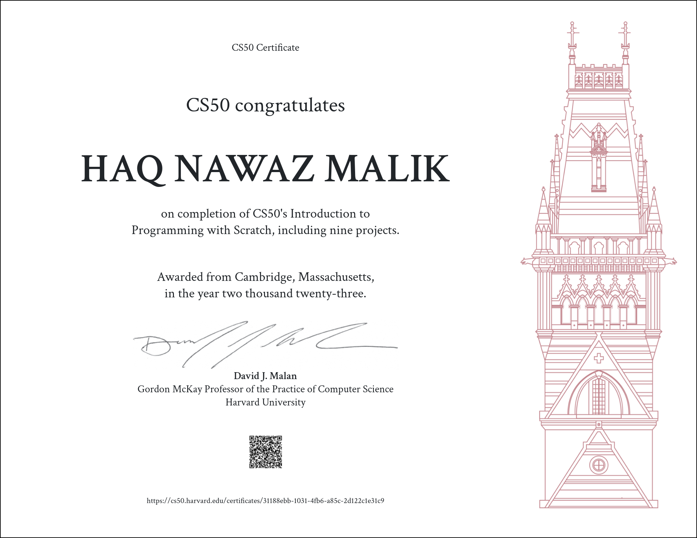

# CS50S
An introduction to programming using Scratch, a visual programming language via which aspiring programmers can write code by dragging and dropping graphical blocks (that resemble puzzle pieces) instead of typing out text. Used at the start of Harvard College’s introductory course in computer science, CS50, Scratch was designed at MIT’s Media Lab, empowering students with no prior programming experience to design their own animations, games, interactive art, and stories. Using Scratch, this course introduces students to fundamentals of programming, found not only in Scratch itself but in traditional text-based languages (like Java and Python) as well. Topics include: functions, which are instructions that perform tasks; return values, which are results that functions provide; conditions, via which programs can decide whether or not to perform some action; loops, via which programs can take action again and again; variables, via which programs can remember information; and more. Ultimately, this course prepares students for subsequent courses in programming.

>This is CS50's Introduction to Programming with Scratch

*Please note that this repository is for storing my projects and files from Harvard University's CS50x course. It is not meant for sharing answers or encouraging academic dishonesty. If you are currently enrolled, please complete the assignments independently and refer to the course materials.*
